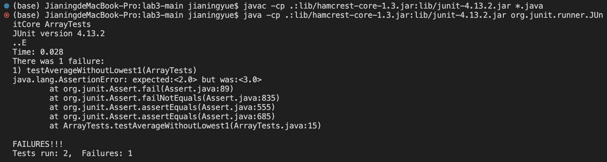
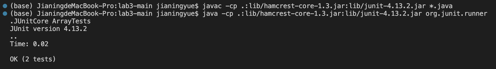

# Lab report 5
---

My favorite lab is lab 3 and my favorite lab report is lab report 2. Because Debug is a very important and useful skill.
I picked `ArrayExample.java` and `ArrayTests.java` to Debug. 
---

## Details about the test
---

We first look at the code in `ArrayExample.java`, Understand the `purpose` and `role` of these codes.
Then we write test code in `ArrayTests.java` to try different inputs. 
This is to test the results returned by the code in different cases

For example:

```
@Test
  public void testAverageWithoutLowest1(){
    double[] input1 = {1, 2, 4};
    assertEquals(2.0, ArrayExamples.averageWithoutLowest(input1), 0.01);
  }
```

This is the test code to check `testAverageWithoutLowest1` method in `ArrayExample.java`. I will also change some other test code to test the return results of other methods

And the output shows what the method should return and what results were actually returned. 
---

Use :

```
javac -cp .:lib/hamcrest-core-1.3.jar:lib/junit-4.13.2.jar *.java
java -cp .:lib/hamcrest-core-1.3.jar:lib/junit-4.13.2.jar org.junit.runner.JUnitCore ArrayTests
```

These two commands work well to compile and run the JUnit.
---

Then we can see the result like this: 

---

It shows Test code with data bias with the expected value and actually value, then I can go back to `testAverageWithoutLowest1` to find the bug and fix it.

Example:

> The code befor I fixed it. 

```
static double averageWithoutLowest(double[] arr) {
    if(arr.length < 2) { return 0.0; }
    double lowest = arr[0];
    for(double num: arr) {
      if(num < lowest) { lowest = num; }
    }
    double sum = 0;
    for(double num: arr) {
      if(num != lowest) { sum += num; }
    }
    return sum / (arr.length - 1);
  }
```

> The code after I fixed it.

```
static double averageWithoutLowest(double[] arr) {
    if(arr.length < 2) { return 0.0; }
    double lowest = arr[0];
    for(double num: arr) {
      if(num < lowest) { lowest = num; }
    }
    double sum = 0;
    for(double num: arr) {
      sum += num;
    }
    sum -= lowest; 
    return sum / (arr.length - 1);
  }
```

Results returned according to the test code. The problem is the befor code only calculated the sum and lowest, so I added a calculation code to subtracts the lowest from the sum.
---

Then run the test with the same input again to check is there still bugs. And I fixed it correctly.

> Here is the screenshot after I fixed the bug and run the text code.

---

Then I use same way to fix other method's bugs.

After week 7's study, we learned namo to fix bugs through the terminal
